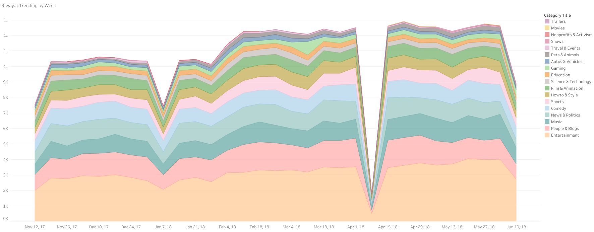
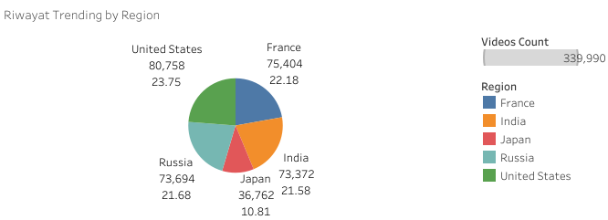
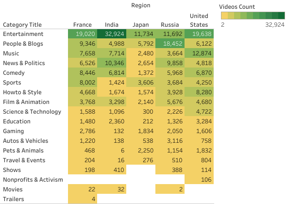
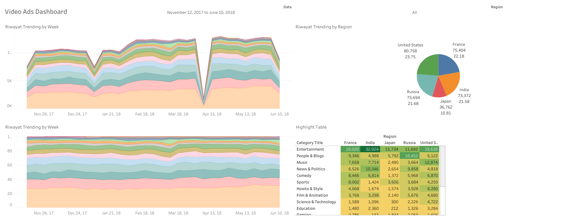

# Visualization Trend Video with Tableau
Project portfolio : Create Visualization and Dashboard with Tableau.

## 1. Business Understanding

Objective :

  - Create a trend-by-week history visualization, this visualization will allow us to observe patterns, trends, andfluctuations that occurred on a weekly basis.
    
  - Trend history by region, by collecting historical data for the chosen metric in each region over a certain period,we can identify trends and patterns unique to each geographic area.
    
  - Highlight table by trend category, the highlight table will enable easy identification and comparison of datapoints within each trend category, facilitating quick insights and analysis.
    
  - Make presentations on historical trends, create presentations that showcase historical trends in a visuallyengaging and informative manner. The presentations will be designed to effectively communicate   patterns,changes, and insights related to specific metrics or key performance indicators over a given time period.

## 2. Data Understanding
Dataset namely `urbanization_rot.csv`, this dataset includes the following columns:

Dataset `urbanization_rot.csv`:

- `Country` — Column with country name.
- `Year` — Date of data sample.
- `Population Type` — Type Urban or Rural.
- `Population` — Population size in a country.

## 3. Visualization
- Trend by Week  

- Trend by Region  

- Highlight Table  

- Dashboard  

## 4 . Conclusion

- Based on weekly trends, the most categories are entertainment, music, people & blogs, comedy, and news & politics.

- The largest distribution of video access is in the United States area, the difference with the area of France, Russia and India is not so big. The lowest is from the Japan area.

- The most popular category is entertainment equals France, India and Japan. But it's not like that in Russia, top popular is people & blogs.
